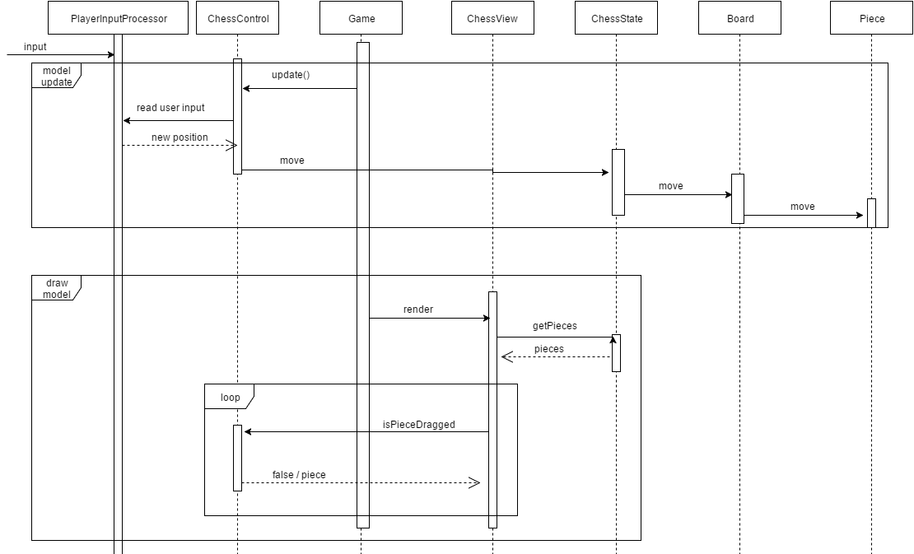

# chkm8 - Chess

This is a java implementation of a standard chess. Goal is that two players
can play this game just like regular chess. White starts first and can move
white pieces and turn changes to black. Winner is the player who can checkmate
the opponent. Player is in check mate if his king is threatened (in check) and
no move can get the king out of check.

This implementation includes basic rules like piece movement as well as kings
castling, pawns en passant and pawn promotion (only to a queen). This game is
still missing GUI elements for declaring a draw or forced draws. This game does
not (yet) have a chess clock so there is no time limit or players themselves have
to regulate time usage.

Game has a simple graphical interface made with
[libGDX](http://libgdx.badlogicgames.com/). Some squares are colored to help the
player see which moves are allowed. Read more in [instructions](instructions.md).

## Structure

I developed this game [Model-View-Controller](https://en.wikipedia.org/wiki/Model%E2%80%93view%E2%80%93controller) design pattern in mind. Games model is wrapped to ChessState class which
contains the standard chess components like a board and move history. Board itself
contains all pieces which extend abstract Piece class.

Games View part is just a ChessView class, which draws the model and displays it
to user. ChessView receives model and controller from Game, which is a God class.

Controller is represented in ChessController class, which uses custom
PlayerInputController class to read users input. Controller manipulates the model
based on user input.  

Even though I managed to isolate model fairly well from other parts, view and
controller are a bit blended and there is no clear divide between them.

## Sequence diagrams

**Initializing the model**

**Player moves a piece to allowed square**

Moving consist of two separate parts:
* Updating the model
* Drawing the model

User moves the piece to allowed square (input). When Game next time updates
controller, ChessController reads the pieces new position from
PlayerInputController class. ChessController asks ChessState to move the piece
accoringly.

When model is updated, Game asks ChessView to draw to model. ChessView gets  
pieces from ChessState and draws pieces in correct positions. If user is
currently dragging a piece, ChessView asks the position from controller and
draws it accordingly.

------------------------------------
# chkm8 - Shakki

**Aihe:** Shakki

Toteutuksessa kaksi pelaajaa voivat pelata shakkia aivan kuten lautapeliä.
Pelaajat valitsevat oman värinsä. Valkoinen pelaaja aloittaa
ensimmäisenä. Kaikki pelin 32 nappulaa sijoitetaan pelin alussa tavanomaisille
paikoilleen ja liikkuvat aivan kuten lautapelissä. Pelaajat voivat vuorotellen
tehdä pelin sääntöjen mukaisia siirtoja ja voittaja on se, joka onnistuu
tekemään matin.

Peliin on myös mahdollista implementoida pelikello, jonka avulla pelaajien
mietintäaikaa voidaan rajoittaa. Jos pelaajalle varattu aika pääsee loppumaan,
pelaaja häviää pelin. Tätä ominaisuutta ei välttämättä implementoida peliin.

Pelissä on yksinkertainen graafinen käyttöliittymä, eikä sen ulkoasuun
kiinnitetä kehityksessä erityisesti huomiota.

## Rakenne
Peli on toteutettu [Model-View-Controller](https://en.wikipedia.org/wiki/Model%E2%80%93view%E2%80%93controller)
arkkitehtuurityylillä. Pelin model on kiedottu ChessState-luokkaan sisältää
kaikki itse shakkiin kuuluvat asiat, esimerkiksi pelilaudan Board ja
liikkumishistorian. Board puolestaan sisältää kaikki pelinappulat, jotka
laajentavat abstraktia luokkaa Piece ja toteuttavat kunkin nappulan erityispiirteet.

Pelin View on luokka ChessView, jonka tehtävänä on piirtää malli ja esittää se käyttäjälle.
ChessView saa Game-luokalta parametrina mallin ja kontrollerin.
Näiden avulla ChessView pystyy piirtäämään nappulat oikeille paikoilleen.

Pelin Controller on ChessController-luokka, joka käyttää PlayerInputController-luokkaa
lukemaan käyttäjän syötettä. Syötteen perusteella ChessController muuttaa mallia
liikuttamalla nappuloita.

## Sekvenssikaaviot

**Mallin alustaminen**

**Pelaaja liikuttaa nappulan hyväksyttyyn paikkaan**

Liikkuminen muodostuu kahdesta erillisestä osasta:
* Mallin päivitys
* Mallin piirtäminen

Käyttäjä liikuttaa nappulan haluamaansa sallittuun paikkaan (input). Kun Game
päivittää seuraavan kerran ChessControlleria, ChessController lukee
PlayerInputController-luokalta sijainnin, johon nappula siirrettiin. ChessController
pyytää ChessStatea liikuttamaan nappulan kyseiseen paikkaan.

Kun malli on päivitetty, Game pyytää ChessViewiä piirtämään mallin. ChessView
lukee nappulat ChessStatelta ja tarkistaa, onko käyttäjä raahaamassa nappuloita.
ChessView piirtää nappulat oikeille paikoilleen.

