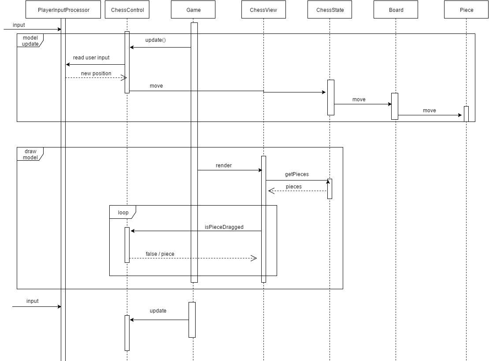

# chkm8 - Shakki

**Aihe:** Shakki

Toteutuksessa kaksi pelaajaa voivat pelata shakkia aivan kuten lautapeliä.
Pelaajat valitsevat oman värinsä. Valkoinen pelaaja aloittaa
ensimmäisenä. Kaikki pelin 32 nappulaa sijoitetaan pelin alussa tavanomaisille
paikoilleen ja liikkuvat aivan kuten lautapelissä. Pelaajat voivat vuorotellen
tehdä pelin sääntöjen mukaisia siirtoja ja voittaja on se, joka onnistuu
tekemään matin.

Peliin on myös mahdollista implementoida pelikello, jonka avulla pelaajien
mietintäaikaa voidaan rajoittaa. Jos pelaajalle varattu aika pääsee loppumaan,
pelaaja häviää pelin. Tätä ominaisuutta ei välttämättä implementoida peliin.

Pelissä on yksinkertainen graafinen käyttöliittymä, eikä sen ulkoasuun
kiinnitetä kehityksessä erityisesti huomiota.

## Rakenne

## Sekvenssikaaviot

**Mallin alustaminen**

**Pelaaja liikuttaa nappulan hyväksyttyyn paikkaan**

